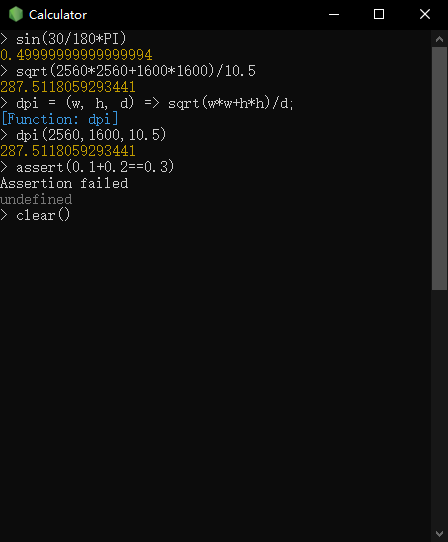

# REPL Calculator

A **REPL**acement to *Windows Calculator*, base on Node.js REPL(Read–Eval–Print Loop) CLI, specially customized for software developers. A single-instance wrapper is also provided for better interop with Calc key (a.k.a. LaunchApp2 or LaunchApplication2 key).

## Features

+ [x] based on Node.js REPL with the following extra changes
  + exposed `Math` functions/constants
  + exposed `console.assert()`, `console.clear()` 
  + removed `global` methods/constructors/objects except constants
  + removed `Object.prototype` methods except `toString`
+ [x] single-instance
+ [ ] top-most

## Install

If your keyboard has Calc key, then you may run [set-LaunchApp2.bat](set-LaunchApp2.bat) to set Calc key to open REPL Calculator. To reset Calc key behavior to default, run [reset-LaunchApp2.bat](reset-LaunchApp2.bat).

## Usage

**Launch**  
If your keyboard has Calc key, press the Calc key to launch REPL Calculator, otherwise run [SingleInstance.exe](SingleInstance.exe) or [calc.bat](calc.bat) to launch REPL Calculator

**Input**  

**Close**  

When closing a window session, eval history will be saved to [.repl_history](.repl_history)

## License

MIT

© 2013 Fuwei Chin and other contributors
